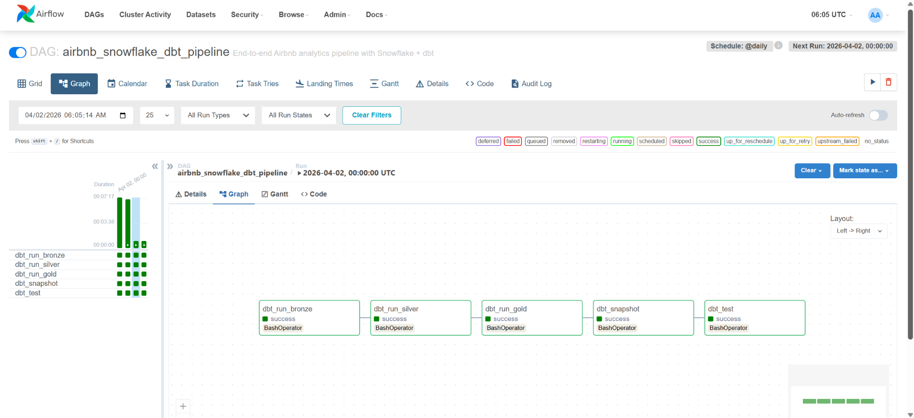

# Airbnb End-to-End Data Engineering Project


## Overview
This project demonstrates a modern data engineering pipeline built using dbt and Snowflake, following a layered approach (Bronze → Silver → Gold) and supports both **Star Schema (fact + dimensions)** and a **One Big Table (OBT)** for ad hoc analysis. This project is designed to reflect a practical data engineering workflow, combining ingestion, transformation, modeling, and orchestration into a single pipeline.


## Architecture

S3 (raw CSV files)  
↓  
Snowflake STAGING (raw ingestion)  
↓  
Bronze (raw copy of source data)  
↓  
Silver (cleaned and standardized data)  
↓  
Gold (analytics layer)  
├── fact_bookings  
├── dim_hosts  
├── dim_listings  
├── dim_date  
└── obt  
↓  
Snapshots (SCD Type 2 history tracking)  


## Key Features
- Data ingestion from **AWS S3** into **Snowflake** for raw layer
- Layered transformations using **dbt (Bronze, Silver, Gold)**
- **Metadata-driven pipeline** design using **Jinja + config-based models**
- **Star Schema** for analytics:
  - `fact_bookings`
  - `dim_hosts`
  - `dim_listings`
  - `dim_date`
- Denormalized **OBT (One Big Table)** for flexible querying
- **SCD Type 2 snapshots** for tracking historical changes
- Data quality validation using dbt tests
- Orchestration with Airflow (batch pipeline)


## Modeling Approach

### Why Star Schema?

The star schema supports structured reporting and scalable BI use cases.  
It separates facts and dimensions to improve query performance and maintainability.

### Why OBT?

The OBT simplifies analysis by removing the need for joins.
It is useful for ad hoc exploration and quick querying by analysts.

This project includes both patterns to reflect real-world tradeoffs.


## Orchestration

The pipeline is orchestrated using Apache Airflow and runs as a daily batch job.

### Pipeline Steps

1. Load raw data from S3 into Snowflake
2. Run dbt models for Bronze, Silver, and Gold layers
3. Run dbt snapshots to track historical changes  
4. Execute data quality tests


## Airflow Orchestration




## Tech Stack
- Snowflake  
- dbt  
- Apache Airflow  
- AWS S3  
- SQL + Jinja


## How to Run

### 1. Load Raw Data

Run the SQL scripts in the `infrastructure/` folder to:
- create tables and stage
- load data from AWS S3  

### 2. Run dbt

```bash
dbt run
dbt snapshot
dbt test
```


## Security Note

Credentials are not included in this repository.